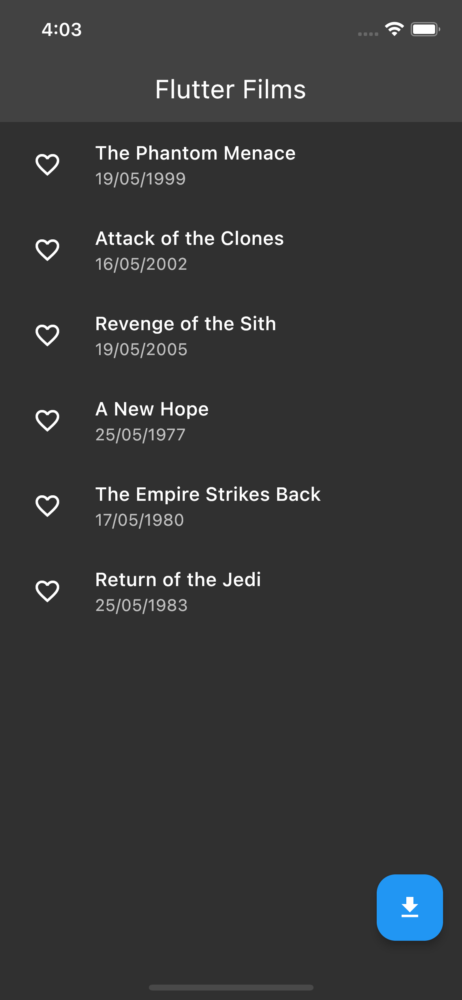
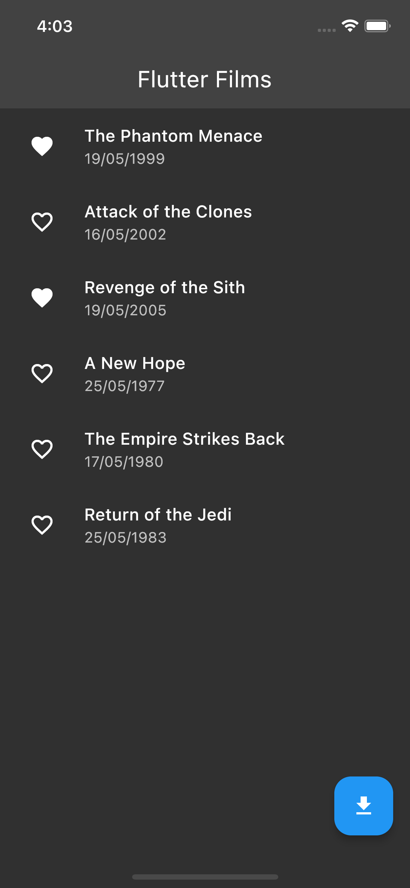

<div id="top"></div>

[![Contributors][contributors-shield]][contributors-url]
[![Forks][forks-shield]][forks-url]
[![Stargazers][stars-shield]][stars-url]
[![Issues][issues-shield]][issues-url]


<!-- PROJECT LOGO -->
<br />
<div align="center">
  <a href="https://github.com/ajvelo/Flutter-Films">
    
  </a>

  <h3 align="center">Flutter Films</h3>

  <p align="center">
    A Flutter project detailing how to implement an application using TDD and clean architecture with Riverpod.
    <br />
    <a href="https://github.com/ajvelo/Flutter-Films"><strong>Explore the docs »</strong></a>
    <br />
    <br />
    <a href="https://github.com/ajvelo/Flutter-Films">View Demo</a>
    ·
    <a href="https://github.com/ajvelo/Flutter-Films/issues">Report Bug</a>
    ·
    <a href="https://github.com/ajvelo/Flutter-Films/issues">Request Feature</a>
  </p>
</div>


<!-- TABLE OF CONTENTS -->
<details>
  <summary>Table of Contents</summary>
  <ol>
    <li>
      <a href="#about-the-project">About The Project</a>
      <ul>
        <li><a href="#built-with">Built With</a></li>
      </ul>
    </li>
    <li>
      <a href="#getting-started">Getting Started</a>
      <ul>
        <li><a href="#prerequisites">Prerequisites</a></li>
        <li><a href="#installation">Installation</a></li>
      </ul>
    </li>
  </ol>
</details>


## About The Project

<div>
<p align="center">
  <a href="https://github.com/ajvelo/Flutter-Films">
      
      
  </a>
</p>
</div>

There are a number of Flutter tutorials out there that illustrate how to build an application with different state management solutions such as `BLoC`, `GetX`, `Riverpod` etc. However most are incomplete, they do not show how to integrate networking and make API calls or how tests can be written. In short, they do not provide an overall solution for clean architecture implementation. This project aims to give an insight into how you would create a production-level application that is scalable, testable and written with clean code.

### Here's what you can expect to learn from this project:

* How to structure your application so that everything is modularised and discrete.
* How to write tests for every module of your application.
* How to structure your architecture in such a way that you can replace modules with different tools/libraries as you see fit. E.g. Replacing your `BLoC` state management with something like `Riverpod`.

There are certainly a number of ways that you can implementation your application such that you abide by the right design principles (SOLID, DRY, YAGNI etc.). However, there is no <strong>one</strong> approach that works better than the others. There is only those that are more modularised. Hence, the approach you should take depends on the project, its requirements and its constraints. For example, if you needed to create an MVP in a short amount of time you certainly wouldn't want to implement an architecture that conformed to TDD and was made of discrete components. You would want to use something that required little boiler-plate code and that should be developed quickly.

With that said, this approach here is not meant for MVP applications but rather for large-scale applications that require unit testing and components that aren't coupled together. I discuss in detail what the approach entails and how and why modules are organised and created in the fashion they are. You can read about it at the README <a href="https://github.com/ajvelo/Flutter-Films/tree/master/flutter_Films">here</a>.

### Built With

This section should list any major frameworks/libraries used to bootstrap your project. Leave any add-ons/plugins for the acknowledgements section. Here are a few examples.

* [Flutter](https://flutter.dev)

## Getting Started

To get a local copy up and running follow these simple example steps.

### Prerequisites

1. Follow the Flutter guide on [Get Started](https://docs.flutter.dev/get-started/install) to install the Flutter SDK on your machine. <strong>NOTE</strong> this project is built with Flutter version 2.8.0.
2. Ensure everything is installed correctly by running the command `flutter doctor --verbose` on your terminal.

### Installation

1. Access the API at [Star Wars API](https://swapi.dev/).
2. Clone the repo
   ```sh
   git clone https://github.com/ajvelo/Flutter-Films.git
   ```
3. Install pub packages
   ```sh
   flutter pub get
   ```

## Roadmap

See the [open issues](https://github.com/ajvelo/Flutter-Films/issues) for a full list of proposed features (and known issues).

## Contributing

Contributions are what make the open source community such an amazing place to learn, inspire, and create. Any contributions you make are **greatly appreciated**.

If you have a suggestion that would make this better, please fork the repo and create a pull request. You can also simply open an issue with the tag "enhancement".
Don't forget to give the project a star! Thanks again!

1. Fork the Project
2. Create your Feature Branch (`git checkout -b feature/AmazingFeature`)
3. Commit your Changes (`git commit -m 'Add some AmazingFeature'`)
4. Push to the Branch (`git push origin feature/AmazingFeature`)
5. Open a Pull Request

## License

Distributed under the MIT License. See `LICENSE` for more information.

<p align="right">(<a href="#top">back to top</a>)</p>

[contributors-shield]: https://img.shields.io/github/contributors/ajvelo/Flutter-Films.svg?style=for-the-badge
[contributors-url]: https://github.com/ajvelo/Flutter-Films/graphs/contributors
[forks-shield]: https://img.shields.io/github/forks/ajvelo/Flutter-Films.svg?style=for-the-badge
[forks-url]: https://github.com/ajvelo/Flutter-Films/network/members
[stars-shield]: https://img.shields.io/github/stars/ajvelo/Flutter-Films.svg?style=for-the-badge
[stars-url]: https://github.com/ajvelo/Flutter-Films/stargazers
[issues-shield]: https://img.shields.io/github/issues/ajvelo/Flutter-Films.svg?style=for-the-badge
[issues-url]: https://github.com/ajvelo/Flutter-Films/issues
