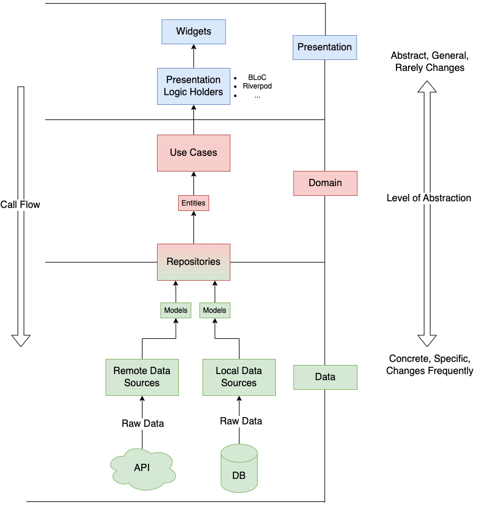

# Clean Architecture

## Background

Before Clean Architecture existed, there were several proposals detailing how to architecture a system. These included ideas such as <a href="https://en.wikipedia.org/wiki/Hexagonal_architecture_(software)">Hexagonal</a>,  <a href="https://jeffreypalermo.com/2008/07/the-onion-architecture-part-1/">Onion</a>, and <a href="http://blog.cleancoder.com/uncle-bob/2011/09/30/Screaming-Architecture.html">Screaming</a> Architecture. Whilst they somewhat vary in implementation, they all propose to do the same thing, that is, modularize the system in an attempt to seperate the concerns. They do this by applying 5 key principles:

1. Independent of Frameworks. The architecture does not depend on the existence of some library of feature laden software. This allows you to use such frameworks as tools, rather than having to cram your system into their limited constraints.
2. Testable. The business rules can be tested without the UI, Database, Web Server, or any other external element.
3. Independent of UI. The UI can change easily, without changing the rest of the system. A Web UI could be replaced with a console UI, for example, without changing the business rules.
4. Independent of Database. You can swap out Oracle or SQL Server, for Mongo, BigTable, CouchDB, or something else. Your business rules are not bound to the database.
5. Independent of any external agency. In fact your business rules simply don’t know anything at all about the outside world.

## Approach

Clean Architecture is an attempt to unify these different approaches in a single actionable idea. It can best be illustrated by the image below.


The concentric circles within the image represent the different areas within software. The closer to the center, the higher-level the software becomes. Notice how the horizonal arrows only point inwards, this is because the sole principle behind Clean Architecture is known as the <a href="https://khalilstemmler.com/wiki/dependency-rule/">Dependency Rule</a>, which states the following:


> An inner layer should never rely on anything from an outer layer.

This means that code dependencies can only point inwards, as indicated by the arrows. A presenter within the interface adapter layer *can't* depend on any mechanisms within the drivers layer. However, a usecase within the application business layer *can* depend on an entity within the enterprise business layer, and so on. The dependencies always point inwards.

The four circles illustrated in the diagram are schematic. There is no rule that states you should only have 4 layers within your software, you have have more, or less, but the main principle of the dependency rule still applies overall.

## Clean Architecture for Flutter

Clean Architecture was conceptualised before Flutter came into existence. In addition, the diagram above relates to a general approach to developing software as opposed to focusing on a specific platform. Nonetheless, we can create our own Clean Architecture diagram and apply it specifically to Flutter.



The first thing to note is we've parted ways with the concentric circles and instead introduced a linear call flow. However, like in the previous diagram, we can see that the Dependency Rule still applies. Our data sources return models, our repositories return entities which in turn is ultimately what will be displayed in our presentation layer.

### Relationship between the data and domain layers

You may have noticed that the repository lies inbetween the domain and data layers, as indicated by the color gradient. The domain layer requires the repository in order to get the models. However, we don't want our domain layer to know anything about the models. Therefore, the repository will be utilised in both layers using the <a href="https://en.wikipedia.org/wiki/Dependency_inversion_principle">Dependency Inversion principle</a>, which is part of the <a href="https://en.wikipedia.org/wiki/SOLID">SOLID principles</a> principles and states the following:

> High-level modules should not import anything from low-level modules. Both should depend on abstractions (e.g., interfaces).

> Abstractions should not depend on details. Details (concrete implementations) should depend on abstractions.

With this in mind, we can create an *abstract* repository within our domain layer, defining what the it must do. We can then *implement* this within our data layer.

We can begin by creating the abstract class in our domain layer.

```dart
abstract class MyRepository {
    Future<MyEntity> getData();
}
```

Finally, we can implement this in our data layer. Note that our data layer (specifically our data sources) will return models, but our domain layer is only concerned with entities as that is what will be ultimately consumed in the presentation layer. We can achieve this in multiple ways but using an extension to map the model to the entity is perhaps the cleanest approach. 

```dart
extension DataModelExtension on DataModel {
    MyEntity get toEntity => MyEntity(
        ...
    );
}
```

We can then use this in our repository implementation within the data layer to return our desired entity.

```dart
class MyRepositoryImpl implements MyRepository {
    final MyRemoteDatasource remoteDatasource;
    final MyLocalDatasource localDatasource;

    MyRepositoryImpl({required this.remoteDatasource, required this.localDatasource});
    @override
    Future<MyEntity> getData() async {
        final dataModel = await remoteDatasource.getData();
        final dataEntity = dataModel.toEntity;
        ...
    } 
}
```

### Consuming the entity in the presentation layer

Once we have successfully returned our entity from the repository, we can call our usecase from any state management solution of our choosing to consume the entity within the our widgets. Since our usecase calls our repository expecting the same data type to be returned, we can *implement* it using the repository abstraction. The only logic it'll have is simply returning the call from the repository.

```dart
class MyUsecase implements MyRepository {
    final MyRepository repository;

    MyUsecase({required this.repository});
    @override
    Future<MyEntity> getData() async {
        return await repository.getData();
    }
}
```

As previously mentioned, the benefit of Clean Architecture is that modularization of the components means that you can easily swap one framework out for the other. For example, you could convert your BLoC solution to Riverpod, or you could exchange one Http client for another. Therefore, it does not matter what state management solution you use, only that it calls the usecase and returns the entity.

Let's take the example we use in the project of calling an API to get a list of movies. When the user presses the button, the call flow will look something like this.

`Widget (presentation) -> Riverpod (presentation) -> Usecase (domain) -> Repository (domain) -> Repository (data) -> Datasource (data) -> API`

As a result, the API will give the datasource a model, the repository will take use that model to create an entity, and the entity will be given to the usecase, which'll ultimately be used in the widget.

### Testing

To conclude our Clean Architecture implementation and check that it is robust, we must right unit tests, testing each module. Our objective is to accomplish the following goals:

1. Ensure that modules are discrete and decoupled.
2. Verify the behaviour of our classes, data types and functions are working as intended.

The file structure of our tests should mirror that of our Clean Architecture structure. That is, have a folder for data, domain and presentation, with the tests within. If the application contains several features, that it may be worth having a top-level `features/` folder for readability.

The tests can be found <a href="https://github.com/ajvelo/Flutter-Films/tree/main/test/features">here</a>.
